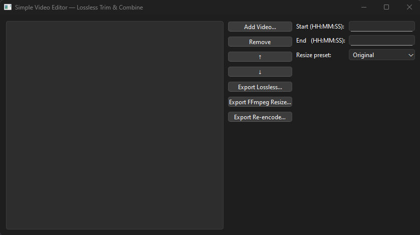

# Simple Video Editor — Trim, Combine & Down‑size



PyQt GUI that lets you trim clips, reorder them, and export in three ways:

| Button                    | What it does | Speed |
|---------------------------|--------------|-------|
| **Export Lossless…**      | FFmpeg `-c copy` – instant packet copy (no re‑encode). | ⚡ |
| **Export FFmpeg Resize…** | Software `scale` ➜ down‑size ➜ `libx264` encode. | ~1 × realtime on modern CPU |
| **Export Re‑encode…**     | MoviePy pipeline – flexible filters, slowest. | 🐢 |

---

## ✨ Features
* Numeric **start/end** trim per clip (hh:mm:ss or seconds).
* **Drag to reorder** or delete clips.
* **Resolution presets** – Original, 1080 p, 720 p, 480 p, 360 p, 240 p (applies to resize/re‑encode paths).
* Works on **pure‑CPU FFmpeg**; GPU builds auto‑detected but *not required*.

---

## 🚀 Quick start

```bash
git clone https://github.com/<your‑handle>/simple-video-editor.git
cd simple-video-editor
python -m venv .venv && . .venv/Scripts/activate    # Windows; use source for mac/linux
pip install -r requirements.txt

# run
python video_editor.py